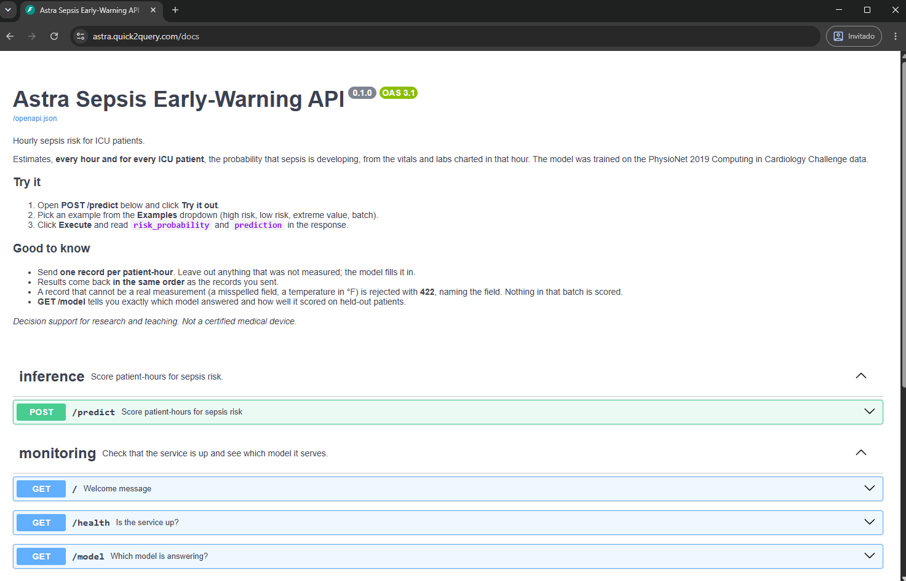

# Astra · Sepsis early warning for the ICU

<p align="center">
  <a href="https://astra.quick2query.com/docs"></a>
  <a href="https://github.com/taed2-2627q1-gced-upc/taed2-astra/actions/workflows/ci.yml"></a>
  
  
  
  
  
  
  
</p>

<p align="center">
  <a href="https://github.com/taed2-2627q1-gced-upc/taed2-astra/graphs/contributors"></a>
  <a href="https://github.com/taed2-2627q1-gced-upc/taed2-astra/commits/main"></a>
  <a href="https://github.com/taed2-2627q1-gced-upc/taed2-astra/pulls?q=is%3Apr+is%3Amerged"></a>
</p>

<p align="center">
  <a href="https://astra.quick2query.com/docs"><b>Try the live API</b></a> ·
  <a href="docs/api.md">API reference</a> ·
  <a href="docs/model_card.md">Model card</a> ·
  <a href="docs/dataset_card.md">Dataset card</a>
</p>

Every hour, for every ICU patient, Astra estimates the risk that sepsis is developing,
from the vitals and labs charted in that hour. Trained on the PhysioNet 2019 challenge
data and served as a REST API. Built by team **Astra** for TAED2 (UPC, GCED).

> **Status:** Milestones 1–3 done (reproducible pipeline, data contract, release gates,
> CO2 reporting). Milestone 4: the API is deployed at
> [astra.quick2query.com](https://astra.quick2query.com/docs).

| | |
|---|---|
| **Model** | Histogram gradient boosting · ROC-AUC 0.81 · recall 0.64 at threshold 0.5 ([model card](docs/model_card.md)) |
| **Data** | PhysioNet 2019, one row per patient-hour ([dataset card](docs/dataset_card.md)) |
| **API** | `POST /predict` scores a batch of patient-hours · live at [astra.quick2query.com](https://astra.quick2query.com/docs) ([API reference](docs/api.md)) |

## Quick start

You need [uv](https://docs.astral.sh/uv/) and `make`. On Windows, install make with
`winget install ezwinports.make`. uv installs the pinned Python by itself.

```bash
git clone git@github.com:taed2-2627q1-gced-upc/taed2-astra.git
cd taed2-astra
make install          # create .venv and install the git hooks
make model            # download the trained model (needs DVC credentials, see below)
make api              # http://127.0.0.1:8000/docs
```

In a second terminal, check the running API end to end:

```bash
make smoke
```

`make model` needs a personal DagsHub token in `.dvc/config.local`. The two commands are in
[docs/development.md](docs/development.md#dagshub-credentials).

## Live API

The API is deployed at **https://astra.quick2query.com**, behind Cloudflare.

<p align="center">
  <a href="https://astra.quick2query.com/docs"></a>
</p>

| Link | What |
|------|------|
| [/docs](https://astra.quick2query.com/docs) | Interactive Swagger UI: pick an example and click **Execute** |
| [/redoc](https://astra.quick2query.com/redoc) | Print-friendly reference |
| [/health](https://astra.quick2query.com/health) | Liveness and version |
| [/model](https://astra.quick2query.com/model) | Served model, MD5 and test metrics |

```bash
curl -X POST https://astra.quick2query.com/predict   -H "Content-Type: application/json"   -d '{"records": [{"Hour": 5, "HR": 104, "Temp": 38.6, "Age": 67, "Gender": 1, "ICULOS": 6}]}'

make smoke API_URL=https://astra.quick2query.com   # the full end-to-end check
```

Cloudflare rejects clients that send no User-Agent or the default `Python-urllib` one
(`403`, error 1010). curl, browsers and `requests` are fine; with `urllib`, set a `User-Agent` header.

## Using the API

| Method | Path | Returns |
|--------|------|---------|
| `GET` | `/health` | Liveness and version |
| `GET` | `/model` | Served model, its MD5 (matches `dvc.lock`), threshold, features and test metrics |
| `POST` | `/predict` | One sepsis risk per patient-hour, in request order |

```bash
curl -X POST http://127.0.0.1:8000/predict \
  -H "Content-Type: application/json" \
  -d '{"records": [{"Hour": 5, "HR": 104, "Temp": 38.6, "Age": 67, "Gender": 1, "ICULOS": 6}]}'
```

```jsonc
// illustrative values
{"predictions": [{"risk_probability": 0.31, "prediction": 0, "warnings": []}], "threshold": 0.5, "model_md5": "4728f865..."}
```

Only `Hour`, `Age`, `Gender` and `ICULOS` are required. Leave out any measurement that
was not taken. Misspelled fields, physically impossible values (a temperature of 98.6 °F,
an FiO2 of 40 %) and numbers sent as text get a `422` that names the field. Extreme but
possible values, such as an HR of 19, and contradicting fields, such as a diastolic above
the systolic pressure, are scored and come back with a warning.
See [docs/api.md](docs/api.md#examples) for ready-to-send low-risk and high-risk examples and the full contract.

## Commands

| Command | What it does |
|---------|--------------|
| `make api` | Serve locally with auto-reload |
| `make serve` | Serve as in production: one worker, no reload |
| `make smoke` | Check a running API (`API_URL=http://<host>` to target another machine) |
| `make model` | Pull only the trained model from DVC |
| `make repro` | Reproduce the pipeline (`prepare → validate → train → evaluate …`) |
| `make qa` | Everything CI checks: lint, tests with coverage, notebook QA |
| `make deploy` | On the VM: pull code and model, restart, smoke-test ([guide](docs/deployment.md)) |

## Repository layout

```
├── src/taed2_astra/   # the package: data, features, modeling, api, visualization
├── tests/             # pytest suite (unit, contract, API, release gates)
├── deploy/            # systemd unit and smoke test for the VM
├── docs/              # cards, API reference, deployment and development guides
├── notebooks/         # exploration only
├── data/  models/     # DVC-tracked, never in Git
├── metrics/  reports/ # scores, validation report, emissions, figures
├── dvc.yaml           # pipeline
└── params.yaml        # every tunable value, the data contract and release gates
```

## Documentation

| Document | For |
|----------|-----|
| [System design](docs/system_design.md) | How training and serving fit together, with diagrams and the reasons behind each choice |
| [API reference](docs/api.md) | Calling the API: endpoints, input contract, errors, testing it locally |
| [Deployment guide](docs/deployment.md) | Running the API as a service on the UPC VM |
| [Development guide](docs/development.md) | Setup, remotes, pipeline, quality assurance, tooling |
| [Model card](docs/model_card.md) | What the model does, how well it scores, where it must not be used |
| [Dataset card](docs/dataset_card.md) | Where the data comes from, what is in it, ethics |
| [AGENTS.md](AGENTS.md) | Conventions: branching, commits, CI, where things go |

## Team

<table>
  <tr>
    <td align="center"><a href="https://github.com/Santi-49"><br><sub><b>Santiago Romagosa</b></sub></a><br><sub>@Santi-49</sub></td>
    <td align="center"><a href="https://github.com/FernanESP0"><br><sub><b>Pablo Fernández</b></sub></a><br><sub>@FernanESP0</sub></td>
    <td align="center"><a href="https://github.com/elenasola"><br><sub><b>Elena Solà</b></sub></a><br><sub>@elenasola</sub></td>
    <td align="center"><a href="https://github.com/julietaa6"><br><sub><b>Júlia Camús</b></sub></a><br><sub>@julietaa6</sub></td>
  </tr>
</table>

`.env` is gitignored and loaded automatically. Never commit a token; tokens are
personal, not shared team-wide. The DagsHub URLs in `.dvc/config` and
`params.yaml` are public and safe to track.

To log runs locally instead of to DagsHub, set `MLFLOW_TRACKING_URI=sqlite:///mlflow.db`
in `.env` — it overrides `params.yaml` without editing a DVC-tracked file.
Browse them with `uv run mlflow ui --backend-store-uri sqlite:///mlflow.db`.

## Workflow

**Pipeline** — `dvc repro` runs `prepare → validate → {benchmark, train → evaluate → fairness, co2_report}`
and `plots`, skipping any stage whose dependencies and params are unchanged. After a
repro, `dvc push` before opening a pull request, so teammates and CI can pull what
`dvc.lock` points at.

**Quality assurance** — `make qa` runs what CI runs: ruff and pylint, the pytest suite
with a coverage floor, and Pynblint. The `validate` stage applies a Great Expectations
data contract (`params.yaml: validation`) to both splits, and
`tests/test_model_quality.py` applies release gates (`params.yaml: model_quality`) to
the trained model, including AIF360 group-fairness gates on `Gender` and `Age`
(`params.yaml: fairness`, audited by the `fairness` stage into `metrics/fairness.json`). See [AGENTS.md](AGENTS.md#ci-and-branch-protection) for the CI checks
that protect `main`.

**Model selection** — `benchmark` scores every candidate listed in
`params.yaml` (`benchmark.models`) on the same patient-grouped CV folds and
writes the ranking to `metrics/benchmark.json`. `train.model` picks the
candidate that ships. Promote one with `dvc exp run -S train.model=<name>`;
iterate quickly with `-S benchmark.max_rows=200000`. The `tabpfn` candidate
(Hugging Face `Prior-Labs/TabPFN-v2-clf`) needs `uv sync --group foundation`
and is skipped otherwise.

**Experiments** — browse runs on the DagsHub MLflow tab. The benchmark logs one
nested run per candidate (params, mean/std metrics, latency, model size,
emissions, model artifact); training logs the shipped model the same way.

**Sustainability figures** — run `uv run astra-plots` to regenerate the
benchmark energy bar chart and duration-vs-energy scatter plot in
`reports/figures/` from `reports/emissions/emissions.csv`.

**API** — `make api`, then open <http://127.0.0.1:8000/docs>.

**Data** — `dvc pull` / `dvc push`. Never `git add` anything under `data/` or
`models/`.

See [AGENTS.md](AGENTS.md) for branching, commit and review conventions, and
[docs/](docs/) for the dataset and model cards.

## Tooling

| Concern | Tool |
|---------|------|
| Code versioning | Git + GitHub Flow |
| Data versioning | DVC |
| Experiment tracking | MLflow |
| Data validation | Great Expectations |
| Testing | Pytest (+ pytest-cov) |
| Linting and formatting | Ruff, Pylint |
| Notebook and repository quality | Pynblint |
| Sustainability | CodeCarbon |
| CI and branch protection | GitHub Actions + repository ruleset |
| Serving | FastAPI |
Licensed under [MIT](LICENSE).
