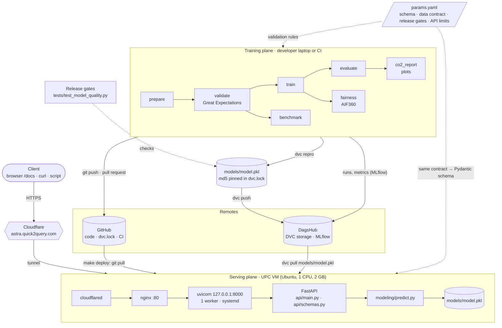
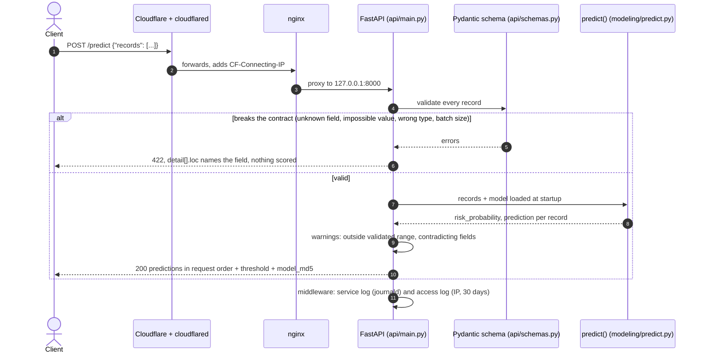

# System design

How Astra fits together as an ML component: how a trained model gets from the pipeline
to the API, and why the design stays this simple. Calling the API is covered in
[api.md](api.md), running it on the VM in [deployment.md](deployment.md).

## Architecture

Astra has two halves that share one file and one contract:

- **Training** runs on a laptop or in CI. The DVC pipeline turns the PhysioNet data into
  `models/model.pkl`, which the release gates test before it is pushed to DagsHub.
- **Serving** runs on the UPC VM. It downloads that exact file, loads it once at startup
  and answers requests behind Cloudflare and nginx.
- **`params.yaml`** defines what a valid patient-hour is. The `validate` stage checks the
  training data against it, and the API builds its request schema from it.

Mermaid source

<!-- TODO(team): confirm that cloudflared forwards to nginx on :80 (not straight to uvicorn on
:8000), and decide whether the tunnel config belongs in deploy/ next to nginx.conf. -->

## A request, step by step

A request that breaks the input contract gets a `422` naming the field, and nothing in
the batch is scored. A valid one is scored by the model loaded at startup, and each
prediction comes back with any warnings and the `model_md5` of the model that answered.

Mermaid source

## Design decisions

| Decision | Why |
|----------|-----|
| **A REST API that scores a batch per call** | A sepsis alert is needed while the clinician waits, and a ward's patients for one hour fit in one request |
| **Training and serving share only `model.pkl`** | The VM runs exactly the file the release gates tested. It never retrains and holds no patient data |
| **`model_md5` in every response** | Any prediction can be traced back to its entry in `dvc.lock`, and from there to the commit and MLflow run |
| **One contract in `params.yaml`** | Training data and live requests are checked against the same rules. Changing a bound changes both |
| **Preprocessing inside the pickled `Pipeline`** | Imputation and scaling travel with the model, so serving cannot drift from what was evaluated |
| **The server refuses to start without a valid model** | A deployment mistake shows up once, at startup, instead of as an error on every request |
| **Reject impossible values, warn about rare ones** | The sickest patients have extreme values and must still be scored. A wrong unit or a misspelled field must not be |
| **No state: no database, no patient history** | Restarts lose nothing, and the model only ever sees one patient-hour at a time |
| **No Docker, queue, feature store or model registry** | One service on one VM. Each would add moving parts without solving a problem we have; the VM-level choices are in [deployment.md](deployment.md#architecture) |
| **No authentication** | A research and teaching demo with no data behind it. A real clinical integration would need auth and rate limiting first |
