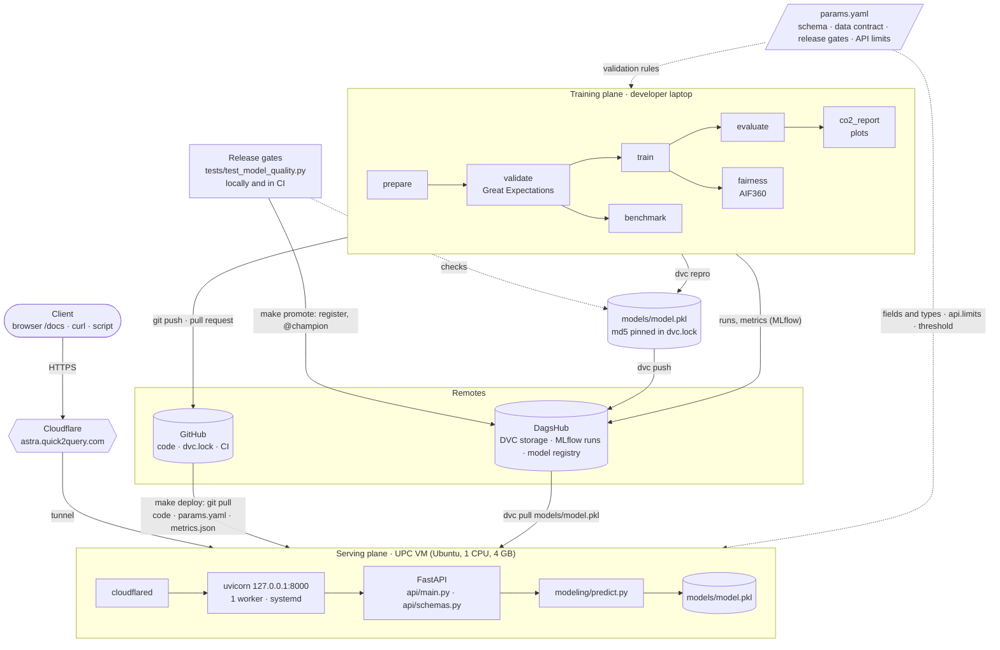
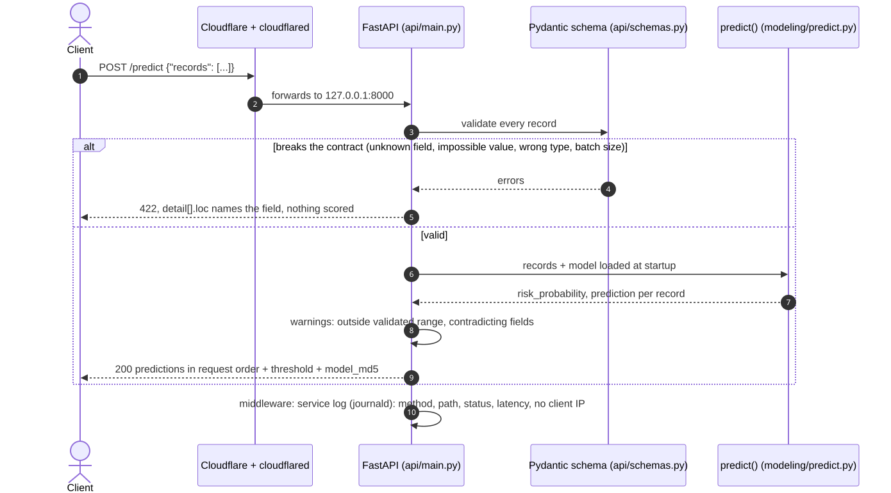
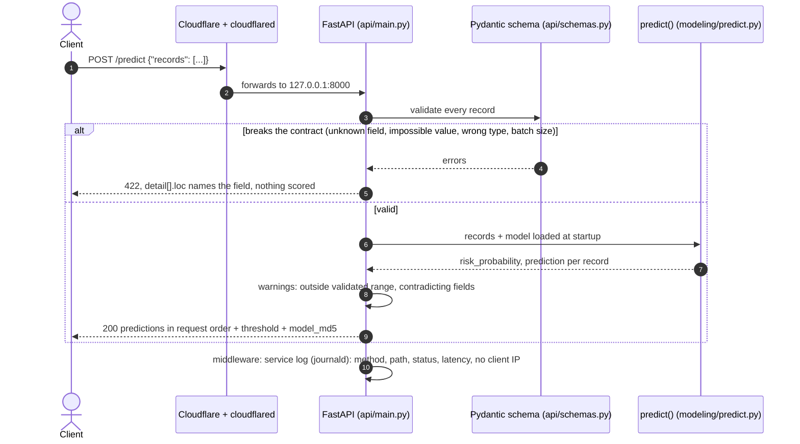

# System design

How Astra fits together as an ML component: how a trained model gets from the pipeline
to the API, and why the design stays this simple. Calling the API is covered in
[api.md](api.md), running it on the VM in [deployment.md](deployment.md).

## Architecture

Astra has two halves:

- **Training** runs on a developer's laptop. The DVC pipeline turns the PhysioNet data into
  `models/model.pkl`, which the release gates test before it is pushed to DagsHub. CI does
  not retrain: on every pull request it re-runs the data contract and the release gates on
  the pushed model, and checks with `dvc status` that `dvc.lock` matches the code. After
  merging, `make promote` registers the gated model in the MLflow Model Registry as `@champion`.
- **Serving** runs on the UPC VM. It gets the model with DVC, and the code, `params.yaml`
  and `metrics/metrics.json` with Git. It loads them once at startup and answers requests
  through a Cloudflare tunnel.
- **`params.yaml`** connects the two. Both sides take the fields, their types and which are
  required from `validation`. The bounds differ on purpose: training data is checked against
  `validation.ranges`, while the API rejects only values outside the wider `api.limits` and
  warns about values outside `validation.ranges`. The API also reads its threshold from it.

Mermaid source

## A request, step by step

A request that breaks the input contract gets a `422` naming the field, and nothing in
the batch is scored. A valid one is scored by the model loaded at startup, and each
prediction comes back with any warnings and the `model_md5` of the model that answered.

Mermaid source

## Design decisions

| Decision | Why |
|----------|-----|
| **A REST API that scores a batch per call** | A sepsis alert is needed while the clinician waits, and a ward's patients for one hour fit in one request |
| **Serving downloads the model, never builds it** | The VM runs exactly the file the release gates tested, with the `params.yaml` and metrics committed alongside it. It never retrains and holds no patient data |
| **`model_md5` in every response** | Any prediction can be traced back to its entry in `dvc.lock`, and from there to the commit and MLflow run |
| **One schema in `params.yaml`** | Training data and requests share the same fields, types and required fields, so the API cannot accept a field the model was not trained on |
| **Preprocessing inside the pickled `Pipeline`** | Imputation and scaling travel with the model, so serving cannot drift from what was evaluated |
| **The server refuses to start without a valid model** | A deployment mistake shows up once, at startup, instead of as an error on every request |
| **Two sets of bounds: reject impossible values, warn about rare ones** | `api.limits` is wider than `validation.ranges`, because the sickest patients have extreme values and must still be scored. A wrong unit or a misspelled field must not be |
| **No state: no database, no patient history** | Restarts lose nothing, and the model only ever sees one patient-hour at a time |
| **A model registry, but no Docker, queue or feature store** | `make promote` registers the gated `model.pkl` in the MLflow Model Registry and moves the `@champion` alias, so the approved model and its history live in one place. The rest is one service on one VM: each would add moving parts without solving a problem we have; the VM-level choices are in [deployment.md](deployment.md#architecture) |
| **No reverse proxy on the VM** | uvicorn listens only on localhost and the Cloudflare tunnel is the only way in, with Cloudflare handling TLS. The cost: no cap on request body size, which a reverse proxy such as nginx would add |
| **No authentication** | A research and teaching demo with no data behind it. A real clinical integration would need auth and rate limiting first |
